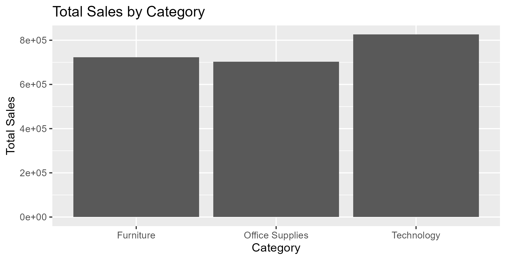
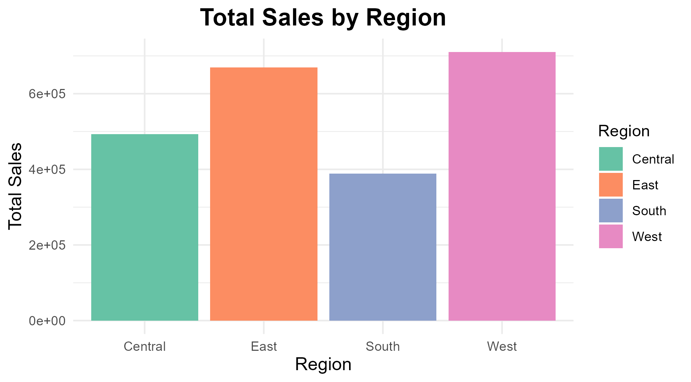
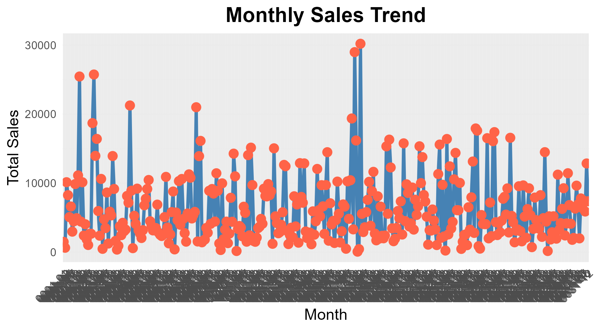
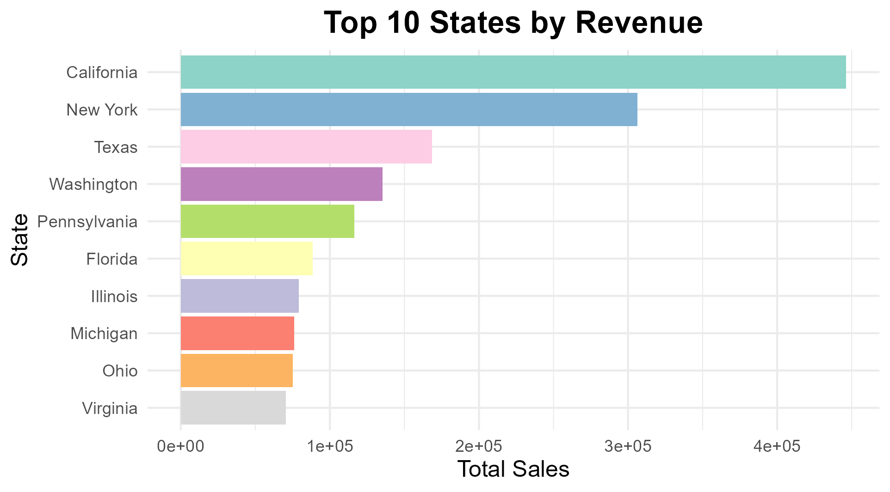

# 📊 Superstore Sales Exploratory Data Analysis (EDA)

A data analysis project that explores retail sales data to uncover insights about **sales performance, regional trends, product demand, and revenue distribution** using the **R programming language**.

This project demonstrates how **Exploratory Data Analysis (EDA)** can be used to understand business data, identify patterns, and support data-driven decision-making.

---

# 📌 Project Overview

The goal of this project is to analyze sales data from a retail superstore and identify important business insights related to:

* Product category performance
* Regional sales distribution
* Top-performing states
* Monthly sales trends
* Product-level revenue contributions

Using **R and data visualization techniques**, the dataset was explored to discover patterns that could help businesses optimize sales strategy and market focus.

---

# 🛠 Tools and Technologies

This project was built using the following tools:

* **R** – Data analysis and processing
* **RStudio** – Development environment
* **tidyverse** – Data manipulation and transformation
* **ggplot2** – Data visualization
* **janitor** – Data cleaning and column formatting
* **lubridate** – Date and time processing

These tools are widely used in **data science and analytics workflows**.

---

# 📂 Dataset

The dataset used in this project is the **Superstore Sales Dataset**, commonly used for learning data analysis and business intelligence techniques.

**Dataset Source:**
https://www.kaggle.com/datasets/vivek468/superstore-dataset-final

### Dataset Columns

| Column           | Description                      |
| ---------------- | -------------------------------- |
| Order Date       | Date when the order was placed   |
| Product Category | Category of the product          |
| Product Name     | Name of the product              |
| Sales            | Sales amount                     |
| Region           | Geographic sales region          |
| State            | State where the order was placed |
| City             | City where the order was placed  |
| Discount         | Discount applied to the order    |
| Quantity         | Number of items ordered          |

The dataset used in this project is stored as:

```
data/train.csv
```

---

# 📁 Project Structure

```
superstore-sales-eda
│
├── data
│   └── train.csv
│
├── scripts
│   └── eda_superstore.R
│
├── plots
│   ├── sales_by_region.png
│   ├── sales_by_category.png
│   ├── monthly_sales_trend.png
│   └── top_10_states_by_revenue.png
│
└── README.md
```

---

# 🔍 Data Analysis Process

The analysis was performed through several stages of exploratory data analysis.

---

## 1️⃣ Data Loading

The dataset was imported into R using:

```
read.csv()
```

The data was then stored as a **data frame** for further analysis.

---

## 2️⃣ Data Exploration

Initial data exploration included:

* Viewing the first rows of the dataset
* Checking dataset structure
* Reviewing summary statistics
* Inspecting column names and data types

These steps helped understand the dataset before performing deeper analysis.

---

## 3️⃣ Data Cleaning

To ensure consistent formatting for analysis:

* Column names were standardized using the **janitor** package
* Data types were reviewed and adjusted where necessary

Clean and standardized data improves analysis accuracy and reduces errors.

---

## 4️⃣ Missing Value Check

Missing values were identified using:

```
colSums(is.na(data))
```

This step ensures the dataset does not contain critical missing values that could affect results.

---

# 📊 Exploratory Data Analysis

Several analyses were performed to understand sales performance across different dimensions.

---

## 📦 Sales by Category

Sales totals were calculated for each product category to determine which category contributes the most revenue.

This analysis helps businesses understand **which product groups drive overall sales**.

---

## 🌎 Sales by Region

Regional sales performance was analyzed to determine which geographic regions generate the highest revenue.

This insight can help companies focus marketing and expansion strategies in **high-performing regions**.

---

## 🛒 Top Products by Sales

Products generating the highest sales were identified using grouped aggregations and sorting.

Understanding product performance helps businesses:

* Optimize product inventory
* Identify popular products
* Improve product promotion strategies

---

## 📈 Monthly Sales Trend

Order dates were converted to date format and aggregated by month to visualize **sales trends over time**.

This analysis highlights **seasonal patterns and fluctuations in sales performance**.

---

## 🏆 Top 10 States by Revenue

Sales were aggregated by state to identify which states generate the most revenue.

This helps businesses understand **where their strongest markets are located**.

---

# 📊 Visualizations

The project includes several visualizations created using **ggplot2**.

### Key Charts

* 📊 Sales by Category
* 🌎 Sales by Region
* 📈 Monthly Sales Trend
* 🏆 Top 10 States by Revenue

Visualization files are stored in:

```
plots
```

---

## Example Visualizations

### Sales by Category



### Sales by Region



### Monthly Sales Trend



### Top States by Revenue



---

# 💡 Key Insights

The exploratory analysis revealed several important patterns:

* Certain **product categories generate significantly higher sales**.
* Sales performance **varies across different geographic regions**.
* A **small number of products contribute a large portion of total revenue**.
* Sales fluctuate across months, indicating **possible seasonal trends**.
* Revenue is concentrated in a **limited number of states**.

---

# 📈 Business Implications

These insights can help businesses:

* Focus marketing efforts on **high-performing regions**
* Increase inventory for **top-selling products**
* Identify **growth opportunities in underperforming regions**
* Use historical trends to support **sales forecasting**

---

# 🎯 Skills Demonstrated

This project highlights several core **data analyst and data science skills**:

* Exploratory Data Analysis (EDA)
* Data cleaning and preprocessing
* Data visualization with ggplot2
* Data manipulation using tidyverse
* Identifying business insights from raw data

---

# 🚀 Future Improvements

Potential extensions of this project include:

* Customer segmentation analysis
* Profitability analysis
* Discount impact analysis
* Sales forecasting using time series models
* Building an interactive dashboard

---

# 👩‍💻 Author

**Pooja Challa**

Data Analysis Portfolio Project
Tools: **R • ggplot2 • tidyverse • RStudio**
