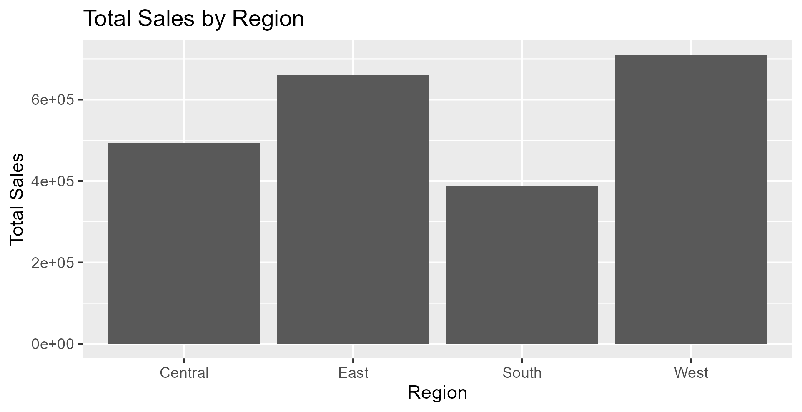
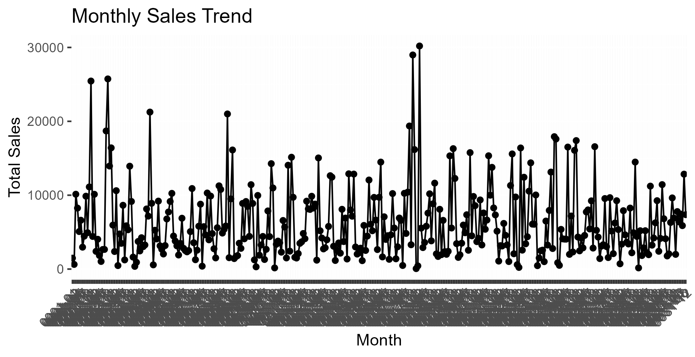
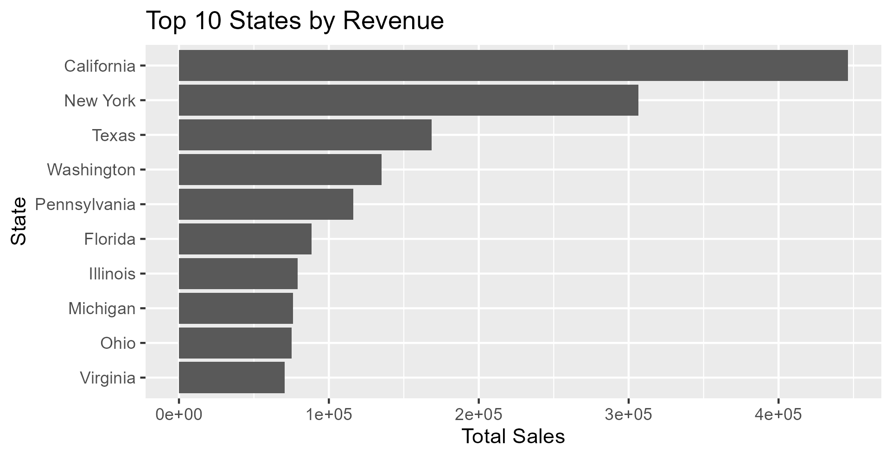

**Superstore Sales Exploratory Data Analysis**
**Project Overview**

This project performs Exploratory Data Analysis (EDA) on a retail Superstore sales dataset to understand sales performance across product categories, regions, states, and time. The analysis focuses on identifying patterns in sales distribution and discovering insights that can support business decision-making.

The project was implemented using the R programming language in RStudio.

**Tools and Technologies**

R

RStudio

tidyverse

ggplot2

janitor

lubridate

**Dataset**

The dataset used in this project is the Superstore dataset, commonly used for data analytics practice.

Dataset Source:
https://www.kaggle.com/datasets/vivek468/superstore-dataset-final

File Used:
Sample - Superstore.csv

Order date

Product category

Product name

Sales amount

Region

State

City

Discount

Quantity

**The dataset used in this project is stored as:**

data/train.csv

**Project Structure**

```
superstore_eda
│
├── data
│   └── train.csv
│
├── scripts
│   └── eda_superstore.R
│
├── plots
│   └── sales_by_region.png
    └── sales_by_category.png
    └── monthly_sales_trend.png
    └── top_10_states_by_revenue.png
│
└── README.md
```

**Data Analysis Process**


**1. Data Loading**

The dataset was imported using read.csv() and stored as a data frame for analysis.

**2. Data Exploration**

Initial exploration included:

Viewing the first rows of data

Checking dataset structure

Reviewing summary statistics

Inspecting column names

**3. Data Cleaning**

Column names were standardized using the janitor package to ensure consistent formatting for analysis.

**4. Missing Value Check**

Missing values were identified using:

colSums(is.na(data))


**Exploratory Data Analysis**

**Sales by Category**

Sales totals were calculated for each product category to identify which category contributes the most revenue.

**Sales by Region**

Regional sales performance was analyzed to determine which geographic region generates the highest sales.

**Top 10 Products by Sales**

Products generating the highest revenue were identified using grouped aggregation and sorting.

**Monthly Sales Trend**

Order dates were converted to date format and aggregated by month to visualize sales trends over time.

**Top 10 States by Revenue**

Sales were aggregated by state to determine which states generate the highest revenue.


**Visualizations**

The project includes several visualizations created using ggplot2, including:

Bar chart of sales by category

Bar chart of sales by region

Line chart showing monthly sales trend

Bar chart showing top 10 states by revenue

**Example visualization:**

**Sales by Category**


**Sales by Region**



**Monthly Sales Trend**



**Top States by Revenue**




**Key Insights**

Certain product categories generate significantly higher sales compared to others.

Sales performance varies across different regions.

A small number of products contribute disproportionately to overall revenue.

Sales trends fluctuate across months, indicating potential seasonal patterns.

Revenue is concentrated in a limited number of states.

**Conclusion**

Exploratory data analysis helps uncover patterns in sales performance and market distribution. These insights can help businesses understand their strongest product categories, most profitable regions, and overall sales trends.

Future analysis could include customer segmentation, profitability analysis, and sales forecasting.

**Author**

Pooja Challa

